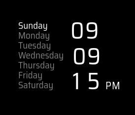

## MMM-BagOfClocks

* Just a bag of clocks. They are what they are.
* Not customizable much.

## Examples

Type1  Type2 

Type3  Type4 

Type5  Type6 

Type7  Type8 

Type9 

Type10 

## Multiple instances

* For you nutcase clock lovers


## Installation

* `git clone https://github.com/mykle1/MMM-BagOfClocks` into the `~/MagicMirror/modules` directory.

## Config.js entry and options

```
{
disabled: false,
module: 'MMM-BagOfClocks',
position: 'bottom center',
config: {
  city:  "USA_NewYork",  // "USA_NewYork", "America%2FNew_York" when type is 10
  type: "2", // 1-10. If type is "10", city format = "America%2FNew_York"
  animationSpeed: 3000,
  updateInterval: 60 * 60 * 1000,
}
},
```

## Trouble finding your city?

* Seek me out on the forum and I'll be glad to help you
